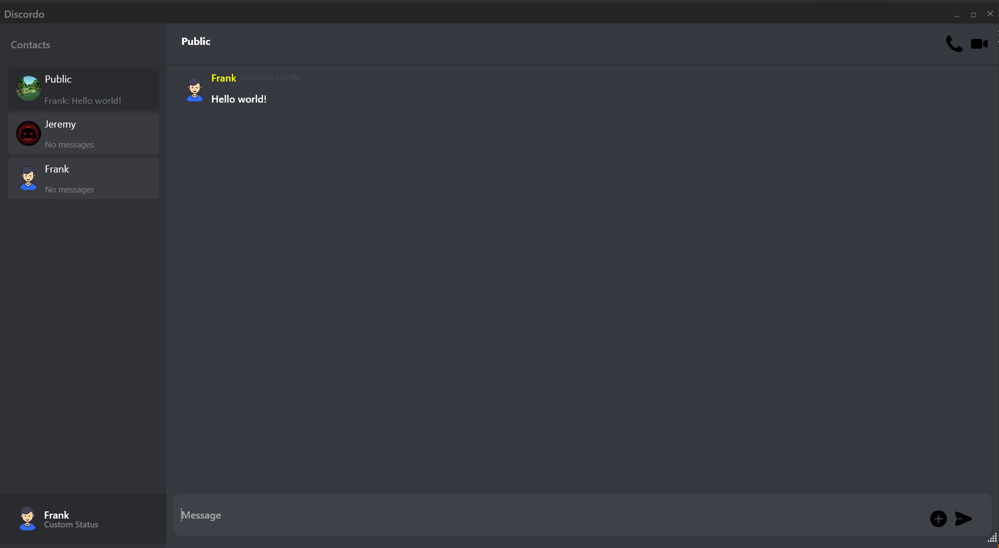
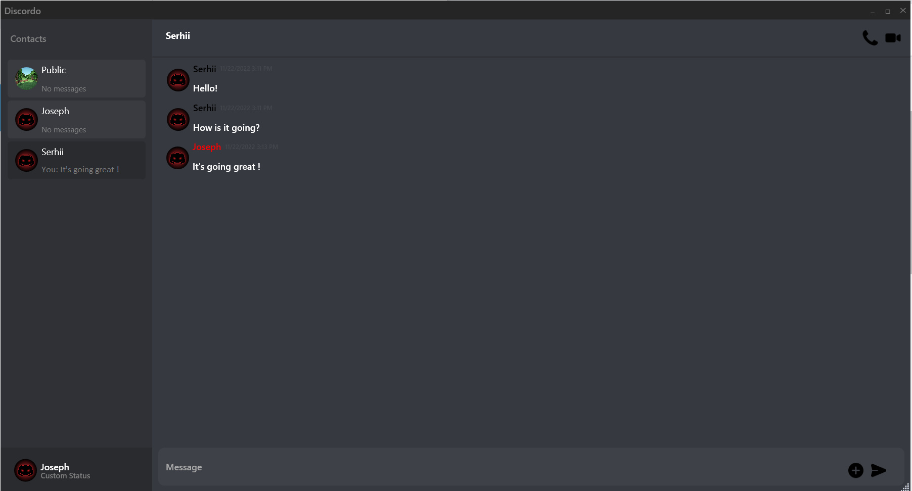

# Discordo

A basic recreation of a Discord text messaging app as a training project to learn how to work with GUI and MVVM architecture 

## Features

- Fully functioning text messenger
- Support of both direct and public messages
- Customizable profile's tag and avatar

## Screenshots

## Tech Stack

C#, WPF
